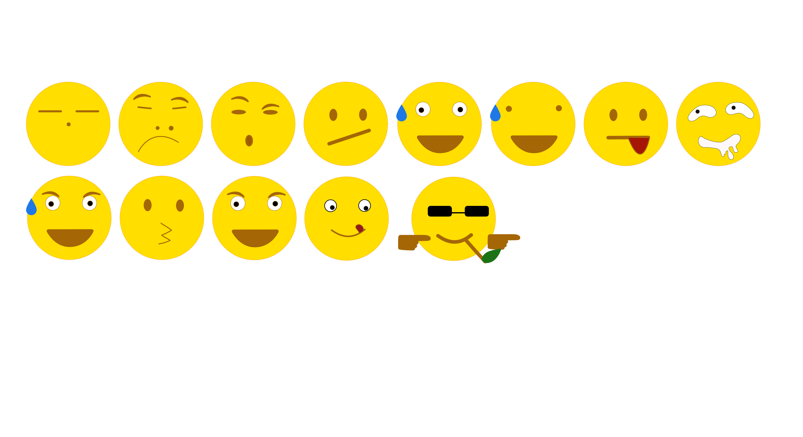
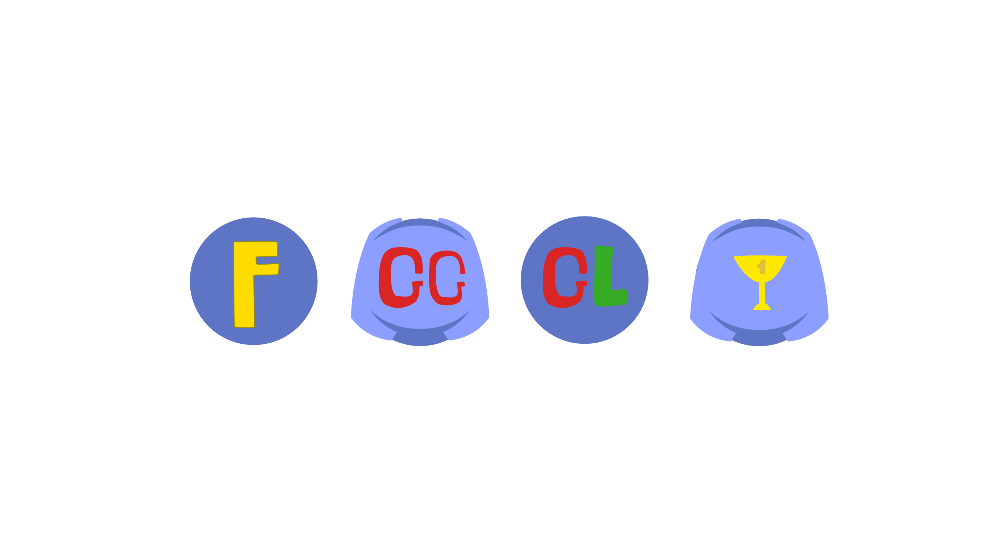

# emojiPack 

### Important: If you're using mobile, click view as Desktop. Otherwise, you will not be able to view this.


Discord [#hackweek](https://blog.discordapp.com/discord-community-hack-week-build-and-create-alongside-us-6b2a7b7bba33) emoji 2019.

With _**65**_ emojis, and _**5**_ of them animated!

If you like this, consider following me on [twitter](https://twitter.com/null0verflows)!

```Full list:```


 I divided this into 5 groups of emojis. 

#### ```Table of contents``` 

| Extended emoji     | Discord face emoji   | Letters emoji  | Wumpus emoji | Animated emoji  | Removed emoji |NOTES   |
| :-------------: |:-------------:| :-----:|:------:|:----:| :-----:| :-----:|
| [here](#Extended-emoji)    | [here](#Discord-face-emoji) | [here](#Letters)| [here](#Wumpus-emoji) | [here](#Animated-emoji) | [here](#Removed-emoji)  |[here](#NOTES)|

## Extended emoji

_You don't think you need these until you see these:_



When you type in ":/", it becomes :confused: 

or ":P", it becomes :stuck_out_tongue: 

or ":v", it becomes packman face; 

or they does not have this face:  "--.--" .

you don't like that? then the emojis above fit perfectly with what you type.

## Discord face emoji

_Memers, here you go_


#### ```FOR MEMERS EXCLUSIVELY```


## Letters 

_F is a must-have in gaming, so is gg!_



## Wumpus emoji

_I love you 3000!_

> No u 


Thor is fat!

## Animated emoji

_It can moves??_

<p float="left">


</p>

Available in ```/animation``` (gif file) and ```/video``` (.MOV file -- higher quality)

## Removed emoji

_There used to be 70+ emojis until I decided to deleted these (deleted 11 emojis):_

<p float="left">


</p>

## NOTES

Removed emojis are removed. I put it there just to remember what I removed.

```/video/``` contains video files for the animations.

```emojiPackNoBG.png``` is a transparent file, so do all the videos in ```/video```.

```/coverArt/coverArt.png``` is the cover Art of this project; it is _not_ an emoji, but rather, the thing that appears when you send a link.

```readme.md``` is available in every folder.

**Thanks to**
@frichicken and @frichickens for feedback, emotional support.
