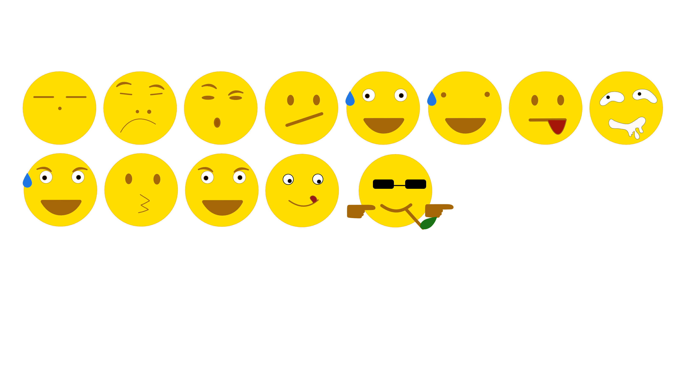
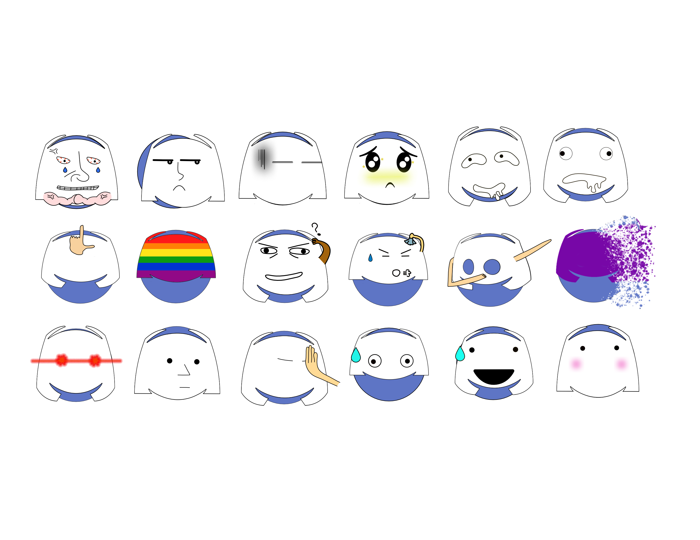
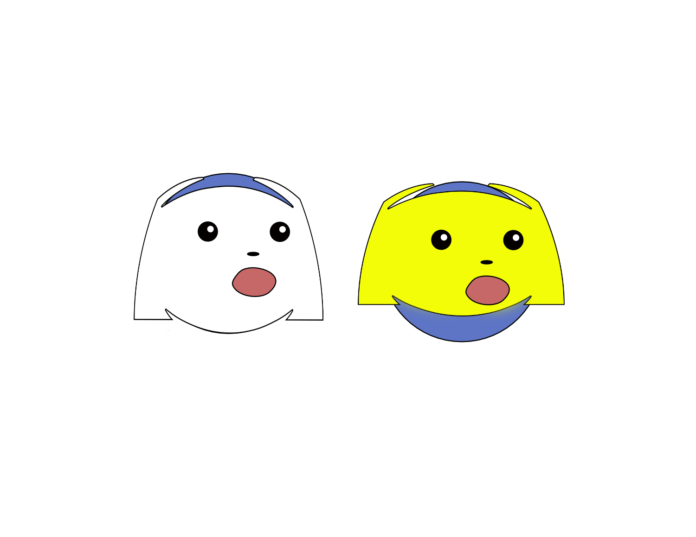
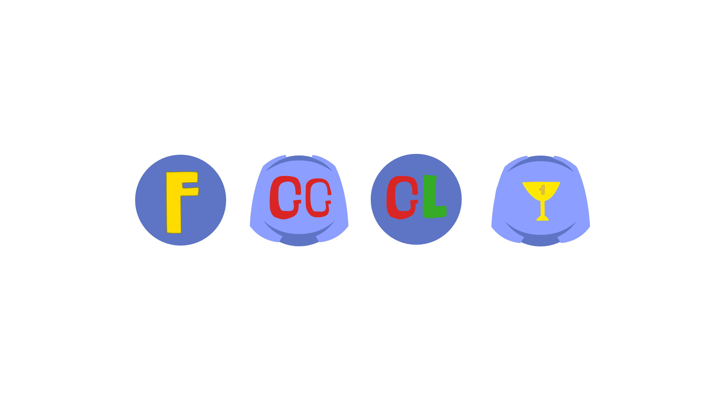

I divided this into 5 groups of emojis

## Extended emoji

_You don't think you need these until you see these_



When you type in ":/", it becomes :confused: 

or ":P", it becomes :stuck_out_tongue: 

or ":v", it becomes packman face; you don't like that? then the emojis above fit perfectly with what you type.

## Discord face emoji

_Memers, here you go_



Some emojis have alternatives 

#### ```FOR MEMERS EXCLUSIVELY```



## Letters 

_F is a must-have in gaming, so is gg!_



## Wumpus emoji

_I love you 3000!_

> No u 


Thor is fat!
